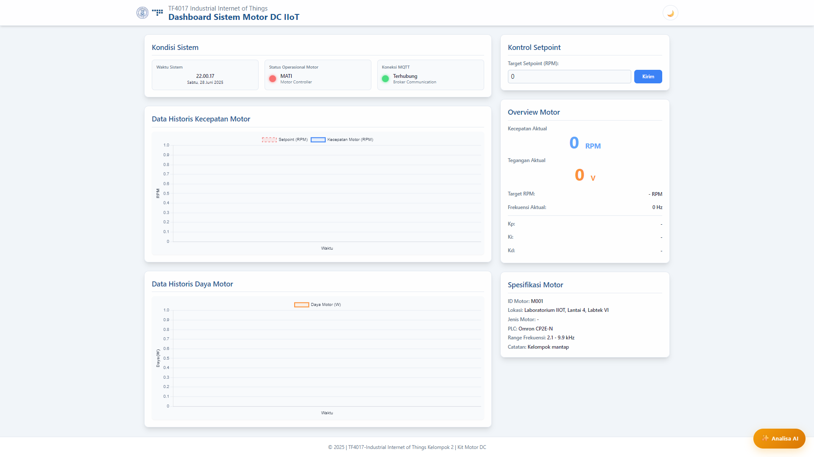
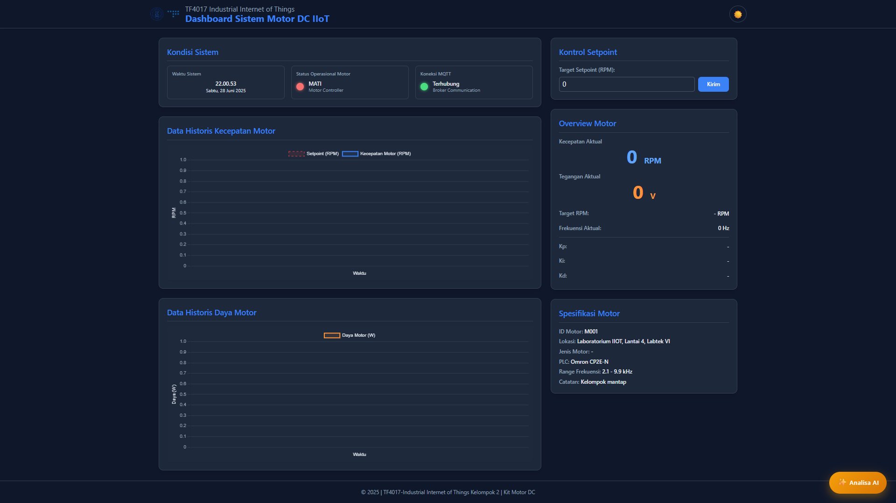

# Dashboard IIoT Motor DC - Sistem Monitoring dan Kontrol




## 📋 Deskripsi Sistem

Dashboard IIoT Motor DC adalah sistem monitoring dan kontrol berbasis web untuk motor DC industrial yang menggunakan protokol MQTT untuk komunikasi real-time. Sistem ini menyediakan interface yang user-friendly untuk monitoring parameter motor, kontrol setpoint, visualisasi data historis, dan analisis AI untuk predictive maintenance.

### ✨ Fitur Utama

- **Real-time Monitoring**: Monitoring kecepatan, tegangan, frekuensi, dan daya motor secara real-time
- **Kontrol Setpoint**: Interface untuk mengatur target RPM motor
- **Visualisasi Data**: Grafik historis kecepatan dan daya motor
- **Dark/Light Mode**: Tema yang dapat disesuaikan dengan preferensi user
- **AI Analysis**: Analisis prediktif menggunakan Google Gemini AI
- **MQTT Integration**: Komunikasi real-time dengan motor controller
- **Responsive Design**: Interface yang optimal di desktop, tablet, dan mobile

## 🏗️ Arsitektur Sistem

```
┌─────────────────┐    MQTT    ┌─────────────────┐    HTTP/WS  ┌─────────────────┐ 
│  Motor + PLC    │ ◄────────► │   MQTT Broker   │ ◄─────────► │   Web Dashboard │
│  (Hardware)     │            │  (Eclipse/HiveMQ│             │   (Frontend)    │
└─────────────────┘            │    Mosquitto)   │             └─────────────────┘
                               └─────────────────┘                     │
                                        │                              │
                                        │ MQTT                         │ HTTP API
                                        │                              │
                               ┌─────────────────┐              ┌─────────────────┐
                               │  Backend Server │ ◄───────────►│   PostgreSQL    │
                               │   (Node.js)     │              │   Database      │
                               └─────────────────┘              └─────────────────┘
```

## 🛠️ Prerequisites (Persyaratan Sistem)

Sebelum memulai instalasi, pastikan sistem Anda memiliki:

### Software Required:
- **Node.js** (versi 16.0 atau lebih baru) - [Download Node.js](https://nodejs.org/)
- **PostgreSQL** (versi 12 atau lebih baru) - [Download PostgreSQL](https://www.postgresql.org/download/)
- **MQTT Broker** (Eclipse Mosquitto/HiveMQ/CloudMQTT) - [Download Mosquitto](https://mosquitto.org/download/)
- **Git** (untuk cloning repository) - [Download Git](https://git-scm.com/)

### Hardware Requirements:
- RAM: Minimal 4GB (Recommended 8GB)
- Storage: Minimal 1GB free space
- Network: Koneksi internet untuk AI features

## 📦 Instalasi Step-by-Step

### Step 1: Download dan Extract Project

#### Opsi A: Jika menggunakan Git
```bash
git clone https://github.com/YOUR_USERNAME/YOUR_REPOSITORY_NAME.git
cd dashboard-iiot-motor-dc
```

#### Opsi B: Jika mendapat file ZIP
1. Extract file ZIP ke folder yang diinginkan
2. Buka Command Prompt/Terminal
3. Navigate ke folder project:
```bash
cd "path\to\project\folder"
```

### Step 2: Install Dependencies

Jalankan perintah berikut di folder project:

```bash
# Install semua dependencies yang diperlukan
npm install
```

**Dependencies yang akan diinstall:**
- `express`: Web framework untuk backend
- `cors`: Middleware untuk cross-origin requests
- `pg`: PostgreSQL client untuk Node.js
- `mqtt`: MQTT client library
- `dotenv`: Environment variables management

### Step 3: Setup Database PostgreSQL

#### 3.1 Buat Database Baru
Buka PostgreSQL command line atau pgAdmin dan jalankan:

```sql
-- Buat database baru
CREATE DATABASE motor_iiot_db;

-- Gunakan database yang baru dibuat
\c motor_iiot_db;
```

#### 3.2 Buat Tabel Motor Logs
```sql
-- Buat tabel untuk menyimpan data motor
CREATE TABLE motor_logs (
    id SERIAL PRIMARY KEY,
    speed NUMERIC(8,2) DEFAULT 0,
    voltage NUMERIC(8,2) DEFAULT 0,
    frequency NUMERIC(8,2) DEFAULT 0,
    power NUMERIC(10,2) DEFAULT 0,
    status VARCHAR(20) DEFAULT 'UNKNOWN',
    target_rpm NUMERIC(8,2) DEFAULT 0,
    kp NUMERIC(10,4) DEFAULT 0,
    ki NUMERIC(10,4) DEFAULT 0,
    kd NUMERIC(10,4) DEFAULT 0,
    timestamp TIMESTAMP DEFAULT CURRENT_TIMESTAMP
);

-- Buat index untuk performance query
CREATE INDEX idx_motor_logs_timestamp ON motor_logs(timestamp);
CREATE INDEX idx_motor_logs_id ON motor_logs(id);
```

#### 3.3 Verifikasi Tabel
```sql
-- Cek struktur tabel
\d motor_logs;

-- Test insert sample data
INSERT INTO motor_logs (speed, voltage, status) VALUES (100.5, 12.0, 'ON');

-- Cek data
SELECT * FROM motor_logs;
```

### Step 4: Konfigurasi Environment Variables

#### 4.1 Buat File .env
Buat file `.env` di root folder project dengan isi:

```env
# Database Configuration
DB_HOST=localhost
DB_PORT=5432
DB_DATABASE=motor_iiot_db
DB_USER=postgres
DB_PASSWORD=your_postgres_password

# Server Configuration
PORT=3000

# MQTT Configuration
MQTT_BROKER_URL=mqtt://localhost:1883

# AI Configuration (Optional)
GEMINI_API_KEY=your_gemini_api_key_here
```

#### 4.2 Sesuaikan Konfigurasi
- Ubah `DB_PASSWORD` dengan password PostgreSQL Anda
- Ubah `DB_USER` jika menggunakan user selain 'postgres'
- Ubah `MQTT_BROKER_URL` sesuai dengan MQTT broker Anda

### Step 5: Setup MQTT Broker

#### 5.1 Install Mosquitto (Windows)
1. Download Mosquitto dari [mosquitto.org](https://mosquitto.org/download/)
2. Install dengan default settings
3. Buka Command Prompt as Administrator
4. Start Mosquitto service:
```bash
net start mosquitto
```

#### 5.2 Install Mosquitto (Linux/Mac)
```bash
# Ubuntu/Debian
sudo apt update
sudo apt install mosquitto mosquitto-clients

# Start service
sudo systemctl start mosquitto
sudo systemctl enable mosquitto

# macOS dengan Homebrew
brew install mosquitto
brew services start mosquitto
```

#### 5.3 Test MQTT Broker
Buka 2 terminal dan test:

Terminal 1 (Subscriber):
```bash
mosquitto_sub -h localhost -t test/topic
```

Terminal 2 (Publisher):
```bash
mosquitto_pub -h localhost -t test/topic -m "Hello MQTT"
```

### Step 6: Konfigurasi MQTT Topics

Sistem menggunakan topics berikut:

**Feedback Topics (dari Motor ke Dashboard):**
- `fb/speed` - Kecepatan motor (RPM)
- `fb/vol` - Tegangan motor (Volt)
- `fb/freq` - Frekuensi motor (Hz)
- `fb/power` - Daya motor (Watt)
- `fb/kp` - PID Parameter Kp
- `fb/ki` - PID Parameter Ki
- `fb/kd` - PID Parameter Kd
- `fb/sp` - Setpoint aktual
- `fb/status` - Status motor (ON/OFF/ERROR)

**Command Topics (dari Dashboard ke Motor):**
- `cmd/sp` - Command setpoint baru

### Step 7: Setup AI Features (Optional)

#### 7.1 Dapatkan Google Gemini API Key
1. Kunjungi [Google AI Studio](https://makersuite.google.com/app/apikey)
2. Login dengan Google Account
3. Buat API Key baru
4. Copy API Key dan tambahkan ke file `.env`:
```env
GEMINI_API_KEY=your_actual_api_key_here
```

## 🚀 Menjalankan Aplikasi

### Step 1: Start Backend Server

Buka terminal di folder project dan jalankan:

```bash
npm start
```

**Output yang diharapkan:**
```
[Server] Server running on port 3000
[Database] Connected to PostgreSQL database
[MQTT] Connecting to broker at mqtt://localhost...
[MQTT] Backend successfully connected to MQTT Broker.
[MQTT] Subscribed to motor topics: ["fb/speed", "fb/vol", ...]
```

### Step 2: Akses Dashboard

Buka web browser dan akses:
```
http://localhost:3000
```

### Step 3: Verifikasi Koneksi

Pada dashboard, cek:
- ✅ **Status MQTT**: Harus menunjukkan "Connected"
- ✅ **Waktu Sistem**: Harus update real-time
- ✅ **Database**: Backend log harus menunjukkan koneksi sukses

## 📊 Menggunakan Dashboard

### 1. Monitoring Real-time

Dashboard akan otomatis menampilkan:
- **Kecepatan Aktual**: Nilai RPM motor saat ini
- **Tegangan Aktual**: Nilai tegangan motor
- **Frekuensi Aktual**: Frekuensi operasi motor
- **Status Operasional**: Indicator visual status motor

### 2. Kontrol Setpoint

1. Masukkan nilai target RPM di field "Target Setpoint"
2. Klik tombol "Kirim"
3. Sistem akan mengirim command via MQTT ke motor
4. Notifikasi akan muncul untuk konfirmasi

### 3. Analisis AI

1. Klik tombol "Analisa AI" (ikon ✨) di pojok kanan bawah
2. Sistem akan menganalisis data motor menggunakan AI
3. Hasil analisis akan ditampilkan dalam modal popup

### 4. Dark/Light Mode

Klik toggle 🌙/☀️ di header untuk mengubah tema.

## 🧪 Testing dan Simulasi

### Test MQTT Communication

#### 1. Test Manual dengan Mosquitto

Simulasi data motor:
```bash
# Test kecepatan
mosquitto_pub -h localhost -t fb/speed -m "1500.5"

# Test tegangan
mosquitto_pub -h localhost -t fb/vol -m "12.0"

# Test status
mosquitto_pub -h localhost -t fb/status -m "ON"

# Test dengan format JSON
mosquitto_pub -h localhost -t fb/speed -m '{"speed": 1200.0}'
```

#### 2. Test Setpoint Command

Subscribe untuk melihat command yang dikirim dashboard:
```bash
mosquitto_sub -h localhost -t cmd/sp
```

### Test Database Connection

Jalankan query untuk cek data:
```sql
-- Lihat data terbaru
SELECT * FROM motor_logs ORDER BY timestamp DESC LIMIT 10;

-- Lihat data dalam 1 jam terakhir
SELECT * FROM motor_logs 
WHERE timestamp >= NOW() - INTERVAL '1 hour'
ORDER BY timestamp DESC;
```

## 🔧 Troubleshooting

### Problem 1: "Cannot connect to database"

**Solusi:**
1. Cek apakah PostgreSQL service berjalan:
```bash
# Windows
net start postgresql-x64-13

# Linux
sudo systemctl status postgresql
```

2. Verifikasi kredensial di file `.env`
3. Test koneksi manual:
```bash
psql -h localhost -U postgres -d motor_iiot_db
```

### Problem 2: "MQTT Connection Failed"

**Solusi:**
1. Cek apakah Mosquitto service berjalan:
```bash
# Windows
net start mosquitto

# Linux
sudo systemctl status mosquitto
```

2. Test koneksi manual:
```bash
mosquitto_pub -h localhost -t test -m "hello"
```

3. Cek firewall settings (port 1883)

### Problem 3: "Module not found" Error

**Solusi:**
1. Install ulang dependencies:
```bash
rm -rf node_modules
rm package-lock.json
npm install
```

2. Cek versi Node.js:
```bash
node --version  # Should be >= 16.0
```

### Problem 4: Dashboard tidak load

**Solusi:**
1. Cek console browser (F12) untuk error JavaScript
2. Verifikasi semua file ada di folder `public/`
3. Restart server:
```bash
# Stop server (Ctrl+C)
npm start
```

### Problem 5: AI Analysis tidak bekerja

**Solusi:**
1. Pastikan `GEMINI_API_KEY` sudah benar di `.env`
2. Cek koneksi internet
3. Verifikasi API key masih valid di Google AI Studio

## 📁 Struktur Project

```
project/
├── README.md                    # Dokumentasi ini
├── package.json                 # Dependencies dan scripts
├── .env                        # Environment variables (buat sendiri)
├── src/
│   └── app.js                  # Backend server utama
├── public/                     # Frontend files
│   ├── index.html              # Halaman utama dashboard
│   ├── css/
│   │   └── style.css           # Custom styles
│   ├── js/
│   │   ├── main.js             # Main application logic
│   │   ├── mqtt.js             # MQTT client handling
│   │   ├── uiHandler.js        # UI interactions
│   │   ├── darkMode.js         # Theme management
│   │   ├── apiHandler.js       # API communications
│   │   └── gemini.js           # AI analysis features
│   └── assets/
│       ├── logo-TF.svg         # Logo files
│       └── TF.svg
```

## 🔒 Security Considerations

### Environment Variables
- Jangan commit file `.env` ke version control
- Gunakan strong password untuk database
- Rotate API keys secara berkala

### Network Security
- Gunakan MQTT dengan authentication jika di production
- Setup firewall rules untuk port yang digunakan
- Consider using MQTT over SSL (port 8883)

### Database Security
- Gunakan user database khusus dengan minimal privileges
- Enable connection SSL jika memungkinkan
- Regular backup database

## 📈 Performance Optimization

### Database
- Monitor query performance dengan `EXPLAIN ANALYZE`
- Consider partitioning untuk data volume besar
- Setup database connection pooling

### MQTT
- Adjust keep-alive settings untuk network conditions
- Use appropriate QoS levels
- Monitor message throughput

### Frontend
- Enable browser caching untuk static assets
- Minimize JavaScript bundle size
- Use efficient chart update strategies

## 🆘 Support dan Bantuan

### Log Files
- **Backend logs**: Console output dari `npm start`
- **Browser logs**: Browser Developer Tools (F12)
- **Database logs**: PostgreSQL logs

### Monitoring Tools
- PostgreSQL: pgAdmin, DBeaver
- MQTT: MQTT Explorer, MQTT.fx
- System: Task Manager, htop

---

**Selamat menggunakan Dashboard IIoT Motor DC Kelompok 2! 🚀**

*Dokumentasi ini dibangun untuk kebutuhan Tugas Laporan TF4017 Industrial Internet of Things.*
